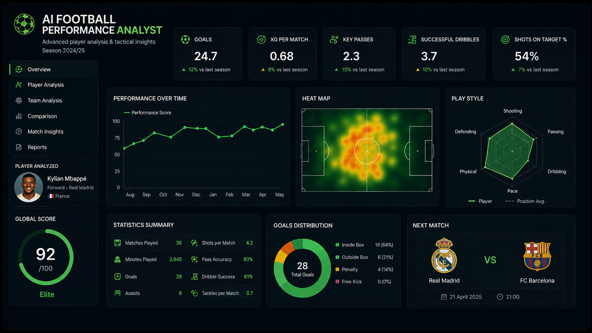
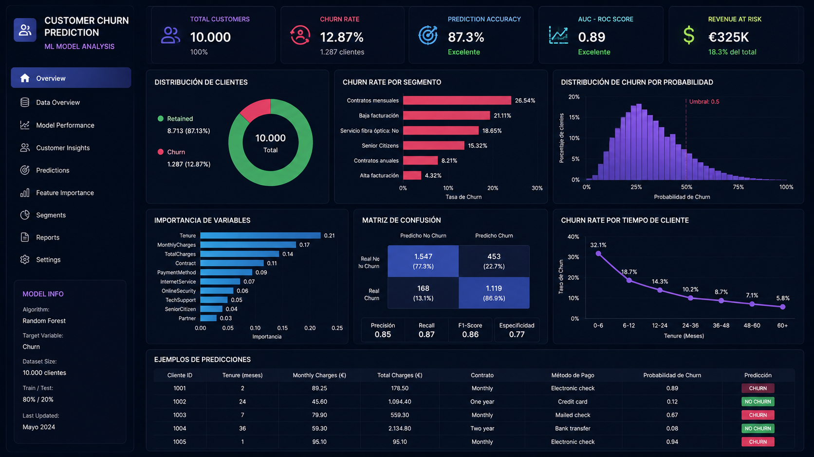
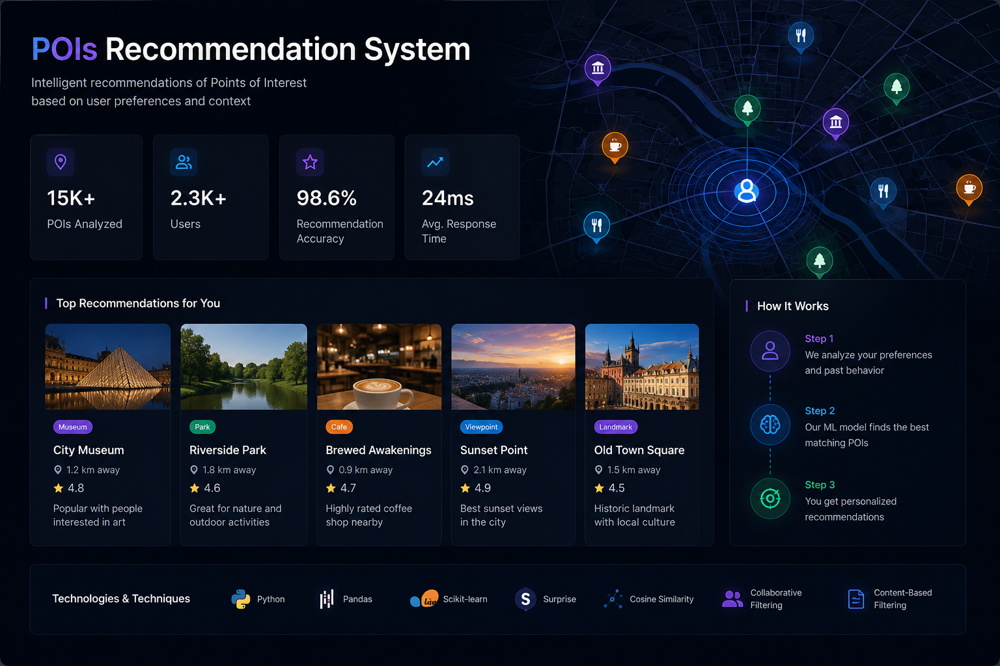
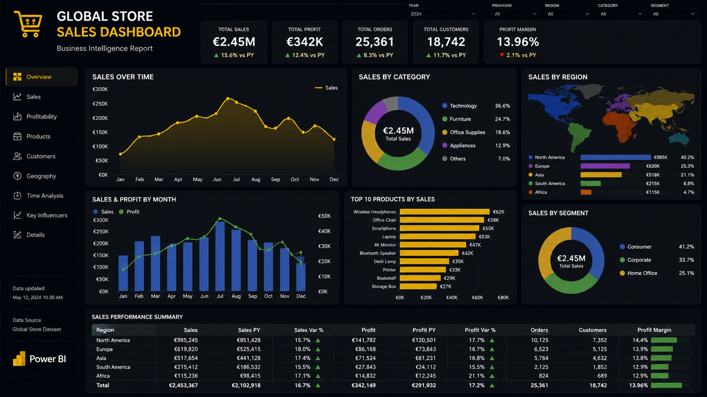
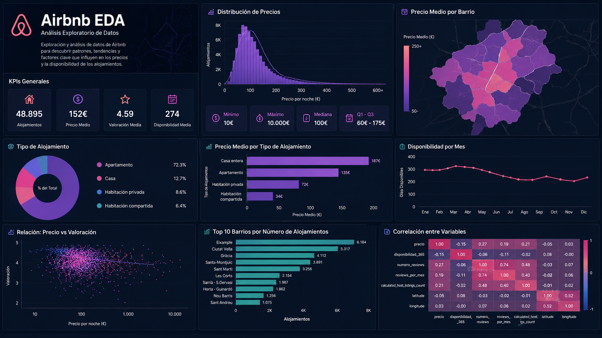

<!-- ====================================================== -->
<!--                    HERO SECTION                        -->
<!-- ====================================================== -->

<h1 align="center">Óscar Fernández</h1>

<h3 align="center">
Data Scientist & Generative AI Engineer
</h3>

<p align="center">
Construyendo soluciones basadas en IA Generativa, Machine Learning y análisis de datos para resolver problemas reales.
</p>

<br>

<p align="center">
  <a href="mailto:oscarcontactweb@gmail.com">
    
  </a>

  <a href="https://www.linkedin.com/in/óscar-fernandez-chinchilla-lopez-b95469313">
    
  </a>

  <a href="https://github.com/OscarFdz24">
    
  </a>
</p>

---

# About Me

```python
class OscarFernandez:

    def __init__(self):
        self.role = "Data Scientist & Generative AI Engineer"

        self.specialization = [
            "Machine Learning",
            "Generative AI",
            "LLMs & RAG Systems",
            "Predictive Analytics",
            "Data Visualization"
        ]

        self.currently_learning = [
            "Deep Learning",
            "MLOps",
            "AI Agents",
            "Advanced RAG Architectures"
        ]

    def mission(self):
        return "Building intelligent systems that solve real-world problems."
```

---

# Tech Stack

<p align="center">
  
</p>

<p align="center">


</p>

---

# Featured Projects

<table>
<tr>
<td width="50%">

## ⚽ AI Football Performance Analyst



Asistente basado en IA Generativa y LLMs diseñado para analizar métricas avanzadas de jugadores de fútbol de la temporada 2024/25 y generar insights tácticos y de rendimiento.

**Tech Stack**  
Python · LLMs · Pandas · Data Analysis · Generative AI

<br>

<a href="https://github.com/OscarFdz24/Asistente_Experto_LLM_Oscar_Fernandez_Evolve">
  
</a>

</td>
<td width="50%">

## 📈 Customer Predict ML Model



Proyecto de Machine Learning enfocado en el análisis del comportamiento de clientes y la creación de modelos predictivos para apoyar la toma de decisiones de negocio.

**Tech Stack**  
Python · Scikit-learn · Pandas · NumPy · Machine Learning

<br>

<a href="https://github.com/OscarFdz24/Proyecto_ML_Clientes_Oscar_Fernandez">
  
</a>

</td>
</tr>

<tr>

<tr>
<td colspan="2" align="center">

## 📍 POIs Recommendation System



Sistema de recomendación de puntos de interés (POIs) diseñado para sugerir ubicaciones relevantes a usuarios mediante técnicas de análisis de datos y recomendación personalizada.

**Tech Stack**  
Python · Recommendation Systems · Machine Learning · Pandas · Data Analysis

<br>

<a href="https://github.com/OscarFdz24/TFG_POIs_Recommender_Oscar_Fernandez">
  
</a>

</td>
</tr>
<td width="50%">

## 🌍 Global Store BI Dashboard



Dashboard de Business Intelligence desarrollado en Power BI para analizar ventas, rentabilidad y métricas clave de rendimiento empresarial a nivel global.

**Tech Stack**  
Power BI · Data Modeling · DAX · Business Intelligence · Data Visualization

<br>

<a href="https://github.com/OscarFdz24/PowerBI_Informe_Modelado_Tienda_Global">
  
</a>

</td>
<td width="50%">

## 🏠 Airbnb Data Analysis



Proyecto de análisis exploratorio de datos (EDA) centrado en descubrir patrones, tendencias y relaciones dentro de datos de Airbnb mediante visualización y análisis estadístico.

**Tech Stack**  
Python · Pandas · Matplotlib · Seaborn · EDA

<br>

<a href="https://github.com/OscarFdz24/ProyectoEDA_Airbnb_Evolve">
  
</a>

</td>
</tr>
</table>

---

# Current Focus

- Generative AI Applications
- LLM Engineering
- RAG Architectures
- Machine Learning Pipelines
- AI-powered Automation
- Data Visualization & Storytelling

---

# Connect With Me

<p align="center">

<a href="mailto:oscarcontactweb@gmail.com">
  
</a>

<a href="https://www.linkedin.com/in/óscar-fernandez-chinchilla-lopez-b95469313">
  
</a>

</p>

<p align="center">
  
📩 <b>Email:</b> oscarcontactweb@gmail.com

🔗 <b>LinkedIn:</b> www.linkedin.com/in/óscar-fernandez-chinchilla-lopez-b95469313

</p>

---

<p align="center">
<i>"Convirtiendo los datos en soluciones inteligentes y aplicadas a negocio."</i>
</p>
</p>


